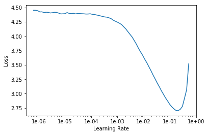
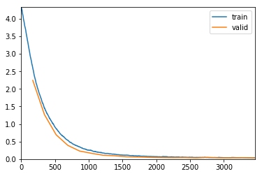
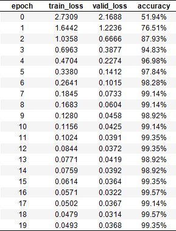
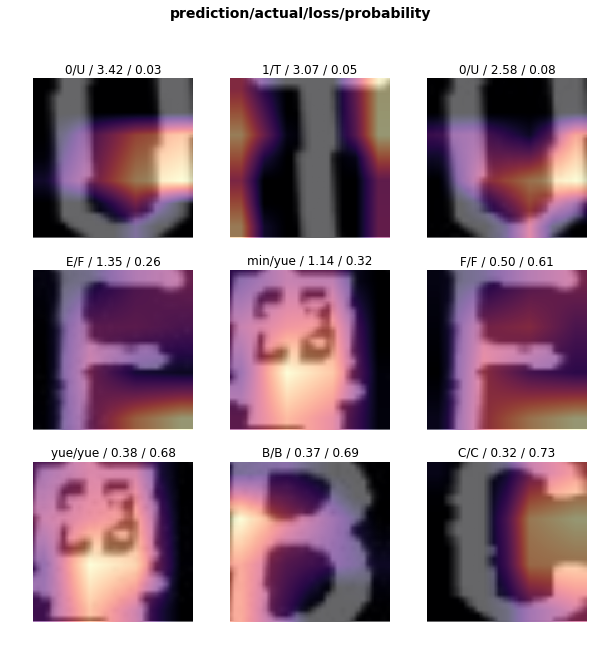
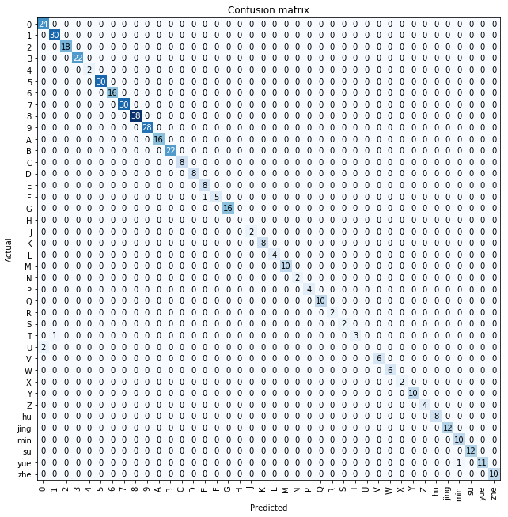
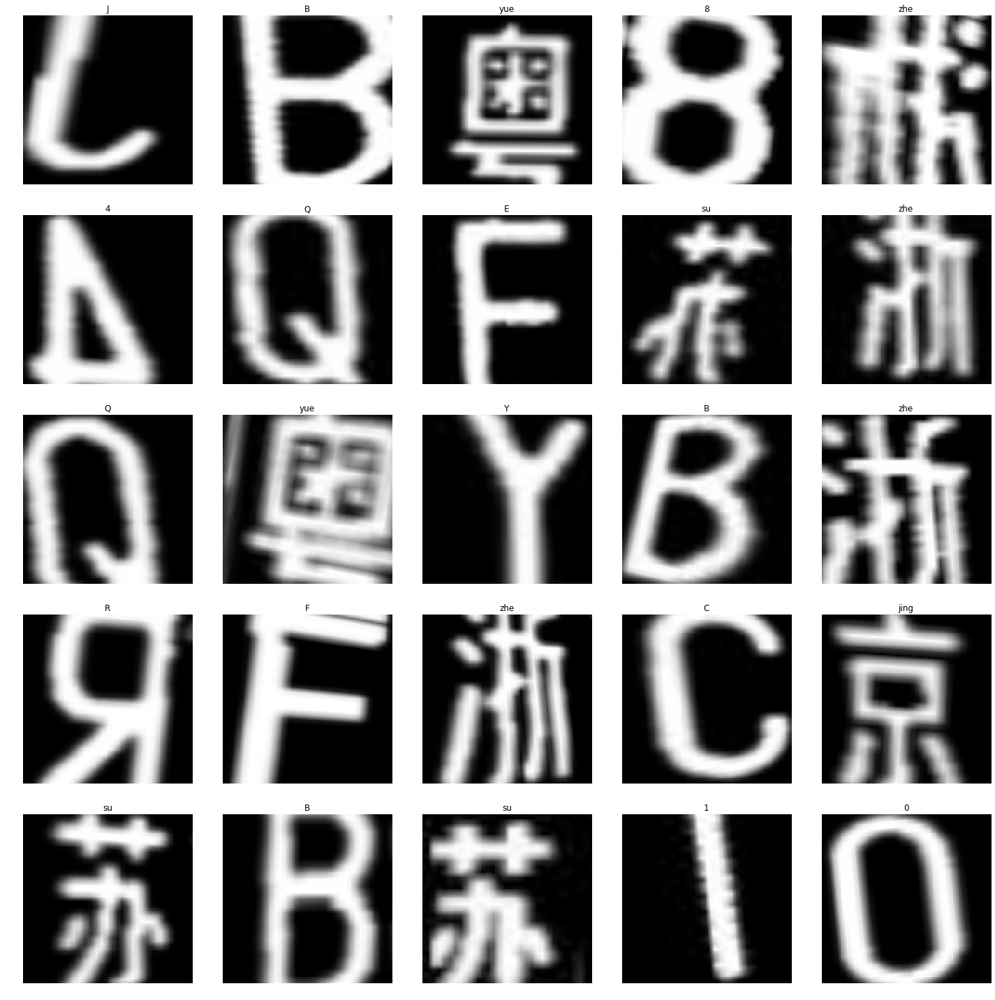

# classify.fastai:smirk:
Classifier based on fastai

[TOC]

字符识别分类器-基于fastai进行构造

以往的fastai教程都是很简单的几行进行一个模型的训练，对初学者来说看起来很简单。但是仅仅训练一个分类的网络是远远不够的，我们还需要各种指标对分类的效果进行评判。

这个库集中了目前比较好的几篇中文博客，并且在此基础上查阅了fastai的API教程（:astonished:但是不得不说 感觉做的没有keras对于tensorflow那样好用，另外用的人感觉不是很多。）进行综合，主要是基于jupyter notebook进行编辑的，py文件也有，但是还不完善，欢迎pull request​ :smile:

## 环境配置:yum:

建议使用anaconda3进行环境的配置和管理，目前使用的fastai以及pytorch都是最新版本的。[链接](<https://docs.fast.ai/install.html>)

- pip安装

    - ```
         pip install fastai
         pip install jupyter notebook jupyter_contrib_nbextensions
        ```

- conda安装

    - ```
        conda install jupyter notebook
        conda install -c conda-forge jupyter_contrib_nbextensions
        ```

- 之后启动命令`jupyter notebook` 然后在网页中打开并运行即可。

## 主要功能:stuck_out_tongue_closed_eyes:

- 提供了数据，在data文件夹下，解压即可使用
    - 如果需要跑自己的分类器，直接替换train,valid等文件夹下的内容即可。
    - 格式为：每个类别一个文件夹，文件夹内放置图片。对命名没有要求。
- 查找合适的learning rate
    - 该功能主要由fastai提供
    - 
    - 这个最低点就是合适的loss取值。（ps:有时候感觉不准）
- 训练模型只需要通过参数传递即可
    - vgg16_bn,vgg19_bn,alexnet
    - resnet18,resnet34,resnet50,resnet101,resnet152
    - squeezenet1_0,squeezenet1_1
    - densenet121,densenet169,densenet201,densenet161
- 训练过程中实时画train-valid-loss图（jupyter notebook很强大）
    - 
    - 像这种图就属于比较完美的，证明learning rate以及数据集安排都很合适。
    - 此外还会展示实时loss-error_rate-accracy等
    - 
- 完成训练后loss可视化
- 训练过程learning rate以及momentum可视化
- 查看主要有哪些图像画错了top error
    - 
- 查看混淆矩阵
    - 
- 查看所有类别
- 将数据集部分内容可视化
    - 

## 说明:sunglasses:

其中可能有很多内容无法运行，由于本人也是初学者，仅通过看博客与API进行fastai的学习，朋友们有时间可以看fastai提供的课程，相信在里边会有详细的讲解。:hugs:

目前主要内容集中于`train_notebook.ipynb`文件中欢迎大家进行fork,star,pull requests。

## 待完成工作:thinking:

- [x] 训练模型保存。

- [ ] 模型结构的设计与改动（尝试了一点但是没有解决bug）。
- [ ] 训练模型的加载与预测。
- [ ] 更好的可视化支持。
- [ ] 更多的分类性能指标。


